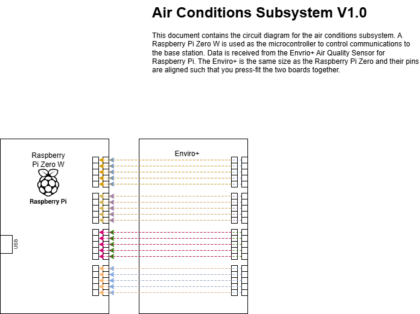
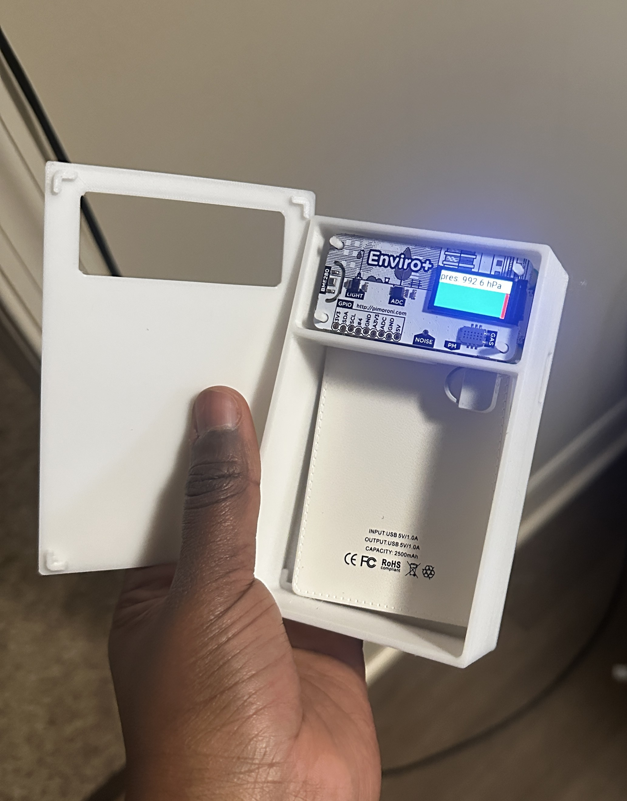
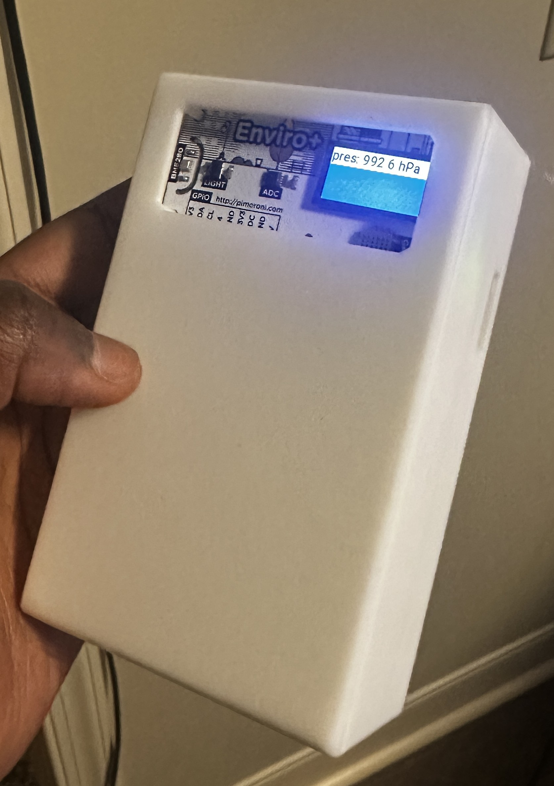

# Enviro+ Python Example

This project demonstrates how to use the Enviro+ breakout board with a Raspberry Pi Zero to display and log environmental data, including temperature, pressure, humidity, light, gas levels, and noise. The data for light, noise, humidity, temp, and the timestamp when it is collected is sent to the base station (Raspberry Pi 5) via MQTT over Wi-Fi. The user can hover their finger over te proximity sensor to switch screens to display temperature, pressure, humidity, light, oxidised gas, reduced gas, nh3, and noise vaules and graphs.

I started with the code from Pimoroni. These are my sources:
- https://github.com/pimoroni/enviroplus-python/tree/main
- https://learn.pimoroni.com/article/getting-started-with-enviro-plus

## Setup Instructions

### 1. Setting Up the Virtual Environment
1. **Install Python and Virtual Environment Tools**:
   ```bash
   sudo apt update
   sudo apt install -y python3 python3-venv python3-pip
   ```

2. **Create a Virtual Environment**:
   ```bash
   python3 -m venv ~/enviroplus-python/myenv
   ```

3. **Activate the Virtual Environment**:
   ```bash
   source ~/enviroplus-python/myenv/bin/activate
   ```

4. **Install Required Python Packages**:
   Inside the virtual environment, install the necessary dependencies:
   ```bash
   pip install -r requirements.txt
   ```
   If you don’t have a `requirements.txt` file, install the following packages manually:
   ```bash
   pip install enviroplus st7735 pillow ltr559
   ```

5. **Deactivate the Virtual Environment**:
   After installing the dependencies, deactivate the virtual environment:
   ```bash
   deactivate
   ```

---

### 2. Running the Script
1. **Activate the Virtual Environment**:
   ```bash
   source ~/enviroplus-python/myenv/bin/activate
   ```

2. **Run the Script**:
   ```bash
   python ~/enviroplus-python/examples/main.py
   ```

---

### 3. Setting up Auto-Run on Startup

To automatically run the `main.py` script whenever the Raspberry Pi is powered on:

1. **Create a Shell Script**:
   Create a shell script to activate the virtual environment and run the script:
   ```bash
   nano ~/enviroplus-python/examples/start_main.sh
   ```
   Add the following content:
   ```bash
   #!/bin/bash
   cd /home/rpi/enviroplus-python/examples
   source /home/rpi/enviroplus-python/myenv/bin/activate
   python main.py
   ```
   Save the file and make it executable:
   ```bash
   chmod +x ~/enviroplus-python/examples/start_main.sh
   ```

2. **Create a Systemd Service**:
   Create a systemd service to run the shell script on startup:
   ```bash
   sudo nano /etc/systemd/system/main.service
   ```
   Add the following content:
   ```ini
   [Unit]
   Description=Run main.py on startup
   After=network.target

   [Service]
   ExecStart=/home/rpi/enviroplus-python/examples/start_main.sh
   WorkingDirectory=/home/rpi/enviroplus-python/examples
   StandardOutput=inherit
   StandardError=inherit
   Restart=always
   User=rpi

   [Install]
   WantedBy=multi-user.target
   ```
   Save the file and reload the system daemon:
   ```bash
   sudo systemctl daemon-reload
   ```

3. **Enable and Start the Service**:
   Enable the service to run on startup:
   ```bash
   sudo systemctl enable main.service
   ```
   Start the service immediately:
   ```bash
   sudo systemctl start main.service
   ```

4. **Verify the Service**:
   Check the status of the service:
   ```bash
   sudo systemctl status main.service
   ```

5. **Reboot to Test**:
   Reboot the Raspberry Pi to confirm the script runs automatically:
   ```bash
   sudo reboot
   ```

---

### 4. Troubleshooting
- **Permission Denied for `air_conditions.json`**:
  Ensure the script has write permissions for the directory:
  ```bash
  sudo chmod -R 775 ~/enviroplus-python/examples
  sudo chown -R rpi:rpi ~/enviroplus-python/examples
  ```

- **Check Logs**:
  If the script fails to run, check the logs for the service:
  ```bash
  journalctl -u main.service
  ```

---

### 5. Hardware Config

- Connect the Enviro+ breakout board to the Raspberry Pi Zero using the GPIO pins.

- Ensure the I2C interface is enabled:
  ```bash
  sudo raspi-config
  ```
  Navigate to **Interface Options** > **I2C** and enable it.

- If using an I2S microphone (e.g., ADAU7002), enable I2S by adding the following to `/boot/firmware/config.txt`:
  ```txt
  dtparam=i2s=on
  dtoverlay=i2s-mmap
  dtoverlay=adau7002-simple
  ```
  Then reboot the Raspberry Pi:
  ```bash
  sudo reboot
  ```

---

### 6. File Structure

Ensure your project directory is structured as follows:
```
enviroplus-python/
├── examples/
│   ├── main.py
│   ├── start_main.sh
│   ├── air_conditions.json
├── myenv/  # Virtual environment
```

---

### 7. Dependencies

The following Python packages are required:
- `enviroplus`
- `st7735`
- `pillow`
- `ltr559`

Install them using:
```bash
pip install enviroplus st7735 pillow ltr559
```

---

### 8. License

This project is licensed under the MIT License.

## Hardware

The Enviro+ press fits into the Raspberry Pi Pico 2w. We powered it using a rechargeable microUSB battery pack.



We 3D printed a casing for it and this is the final design:

 

You can find the stl files to print in the *CASE_3D_Print folder*.