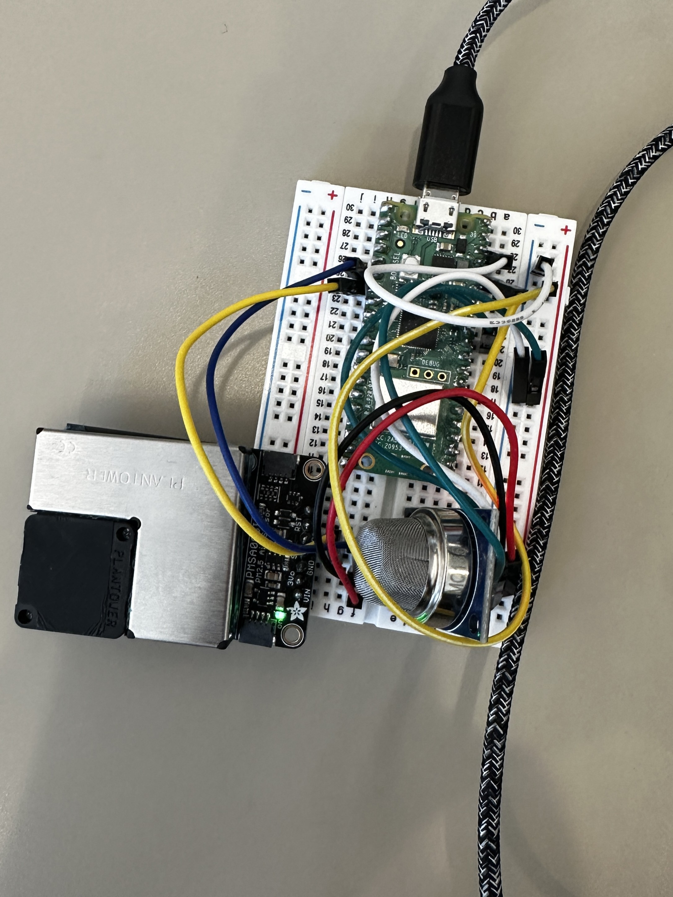

# Particulate Matter & CO2 Substation

This code is meant to be run on a Raspberry Pi Pico 2W running CircuitPython firmware. Currently it collects data from the PMSA003I particulate matter sensor and the MQ-135 CO2 sensor.

## PMSA003I

- VIN to 3V3
-  GND to GND
-  SCL to GP5
-  SDA to GP4

## MQ-135

- A0 to GP26
Notice the code has a value for temperature and humidity. Those are placeholder values that help correct the C02 levels. they will be upated with actual values once we set up the Enviro+.

## Other Info
- code.py has the code to read from the PMSA003I
- CO2code.py has code to read from the MQ-135
- all libraries are available online except the MQ135cpy.py lib which is my edit of the micropython library for the mq135 by Rubfi (https://github.com/rubfi/MQ135)

