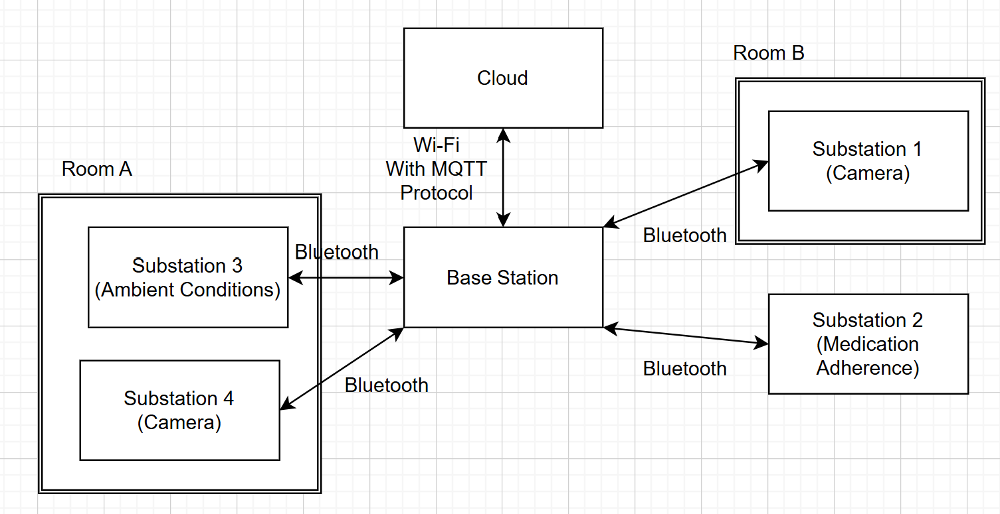
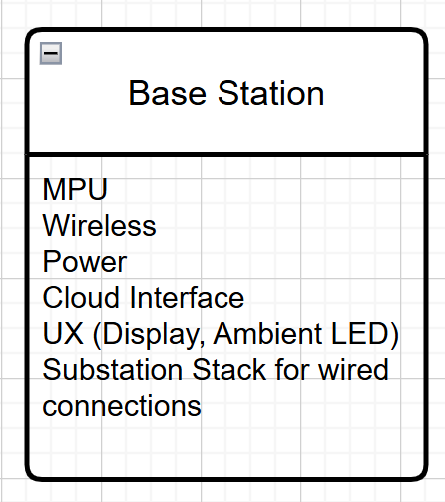
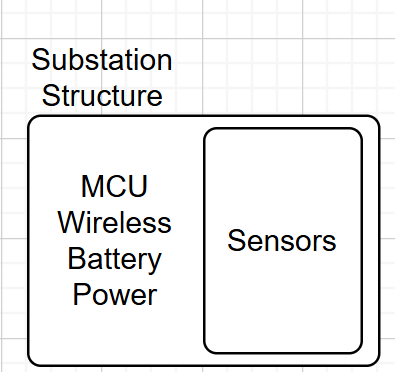

# Environmental Hardware and Firmware
> Code for environmental HW/FW Subteam

## Introduction

This code is for monitoring the health and well-being of post-partum mothers as part of the Fourth Trimester Health project sponsored by Honda 99P Labs. This particular repository is for the Environmental Hardware/Firmware subteam for spring 2025.Each substation has more info on setup and dependencies in the README in their associated folder or branch.

### Team Members:
- Adwoa Asare (ECE M.S.)
- Adrian Cantu (ECE M.S.)
- Tianyi He (ECE M.S.)
- Shao-Ju Wang (ECE M.S.)

## Hardware Configuration

Our design consists of a basestation that acts as a central hub to receive data from various substations over bluetooth, Wi-Fi, or physical connection. Users can have as many as each type of substation as needed. Once substations send their data to base, the base station will send that data to the cloud using MQTT so it can be analyzed by intelligence.

The base station is run on a Raspberry Pi 5 with a 7 inch touch screen display. The thermal Camera substation is mopunted to the case of this set up and plugs into the base station directly. The base station has pins that can be connected to any substation to do a set-up handshake that gives the substations the necessay information to connect to the base station wirelessly.

Each substion is run by a microcontroller (either RPi pico 2w, RPi zero 2w, or STM32) connected to a rechargeable power bank, except for the thermal camera.

## Ambient Conditions/Air Quality
There are 2 types of base stations for air quality. One of them measures C02 and particulate matter. The code for collecting data with this substation can be found in the *PM_C02_substation folder*. The code for the Wi-Fi connectoivity and communicating to the base station using HTTP is in the *tianyi_PMCO2_wifi_cloud branch*.

The other air quality branch measures temperature, pressure, humidity, light, proximity, noise, NH3, and reducing and oxidising gases using the Enviro+ Breakout board and displays them on the screen. It sends the data to the base station over Wi-Fi usign MQTT. You can find the code for this in the *Enviro+_substation folder*.
## Medication Adherence Pill Organizer
You can find the code for the medication adherence substation in the *Pill_Organizer branch*. The pill organizer is run on an STM32 microcontroller and communicates to the base station using Bluetooth. It has an array of infrared sensors for each pill slot to detect the presence of pills after auto-callibration.
## Thermal Camera

The thermal camera uses the deep seek library. We run the code for it directly on the base station.